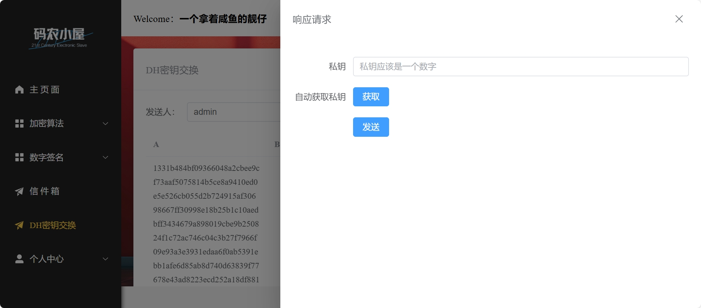

# 加解密系统的实现

## 项目简介
本项目实现了一个简单的加解密系统，支持常用经典密码加解密，ECC数据签名，DH密钥交换，用户间文件传输等功能。系统提供了图形化用户界面（UI），用户可以选择加解密算法并输入数据进行加解密操作。

---

## UI 界面展示
下图展示了系统的主要用户界面：


---

## 功能模块
### 1. 加解密模块
实现了多种加密算法，包括：
- 对称加密（Affine, Autokey, Caesar, ColumnPermutation, DES, RC4, Playfair, Vigenere）
- 非对称加密（RSA）
- 数据签名(ECC)


界面展示如下：


---

### 2. 用户模块
功能信息：
- 登录
- 注册
- 找回密码（邮箱验证码）
- 完善信息（头像，邮箱，昵称）

界面展示如下：


---

### 3. 信件系统模块
实现了用户间的信件传递：
- 信件标题
- 接收人（对应的用户名）
- 加密算法（可写可不写）
- 上传文件（采用了aliyun的OSS存储，下载的时候响应速度会快一些）
- 文件内容（可写可不写）

查看文件的时候点击文件标题就可以了

界面展示如下：


---

### 4. DH密钥交换模块
实现了DH密钥传输过程：

#### 1.A发起DH交换请求
提供自动生成私钥，也可以自己写，选择交换密钥对象，私钥不会存入数据库所以要自己保存好


#### 2.B响应DH交换请求
B更新自己的私钥，生成公钥


#### 3.计算公共密钥
在信息完善后就可以进行计算了


#### 4.DH公共密钥删除
在任意一方进行删除就会在双方的存储系统中都删除，宣布报废


---


## 系统架构
### 1. 前端
- 使用 **Vue3**设计用户界面。
- 提供友好的交互体验。

### 2. 后端
- 基于 C++ 的加密算法实现
- 基于SpringBoot的后端框架

### 3.数据库
- MySQL进行用户数据，信件数据，DH公钥存储
- Redis进行登录token存储管理

---

## 使用说明
1. 克隆项目到本地：
   ```bash
   git clone git@github.com:ZixinYan/CryptographySystem.git

2. 完善AliOSSUtil类，把自己的buket名称和AccessKey填进去
3. 在application.yml配置数据库信息
4. 在vscode文件夹下的是本项目的前端文件，tool文件夹下的本项目用到的加解密程序，fileStorage中存储了加解密中上传的文件，result中存储了加解密的结果文件
5. 在文件存储和调用都用的是绝对路径，所以运行需要更改，具体就是在每一个serviceImpl中改一下，还有在FileUpload的类中改一下方法存储的地址

## 其他
1. 本系统的接口文档信息在https://www.yuque.com/yuqueyonghuutagdr/fbmk9t/bte5dfbcd2watgc9?singleDoc#
   这个链接有时间限制，如果过期了还需要的话可以发文件找我
3. 系统有一些设计暂时有缺陷，但是大体功能已经完善，其中的素材基本都源于网上，可以替换

---
## 对于项目具体的功能说明
总体上，项目实现了一个简单的加解密系统，支持常用经典密码加解密，ECC数据签名，DH密钥交换，用户间文件传输等功能。系统提供了图形化用户界面（UI），用户可以选择加解密算法并输入数据进行加解密操作。
系统的设计上，采用SpringBoot作为后端框架，Vue3作为前端框架，MySQL和Redis存储数据。后端实现网站架构的设计，数据处理，加解密算法调用的功能，前端提供用户友好的交互界面，MySQL存储双机通信的时候产生的数据，Redis中存储用户登录时的token信息
具体功能上，有以下几点：
首先是用户相关模块：用户可以进行基础的登录注册操作，除此之外，提供了完善用户信息功能，可以注册自己的邮箱用于验证码找回密码，上传用户头像，设置用户昵称等。在用户登录之后，系统会利用jwt和HMAC256加密算法为用户自动生成一个token，在此之后的每个网页请求必须带上token才能正常访问，否则会被后端设置的拦截器拦截。
第二是加解密模块与数字签名模块，字符串加解密上，前端获取用户输入的信息，以json的格式传入后端解析，利用其中的参数传入调用的C++加解密脚本，读取命令行的输出结果，再在前端回显完成加解密操作；文件加解密上，前端上传文件后，后端会自动将文件保存到本地，然后进行加解密后将资源上传到网站上，并生成对应的文件下载链接回显到前端输出，用户可以通过下载链接进行下载。同理，数字签名也依此设计
第三是文件传输交互功能，在网站设计上制作了一个类似邮件收发的功能，发送方写信件并确定接收方，信件内容可以包括标题，文字内容，文件附件，加密算法类型等，之后信件被存入MySQL中保存，然后返回前端成功，之后接收方和发送方的界面上会显示这封邮件并且可以随时查看信件内容并下载其中附件
第四是DH密钥交换模块，这里和信件收发设计类似，与之不同的是过程更符合DH交换的过程，发起DH交换的一方需要先输入自己的私钥（也可以由系统自动生成）并确定对方的信息，然后后端会自动生成一个大素数p和生成元g并计算发送方公钥存入数据库，在此过程中用户私钥不会被存入数据库中，保证数据安全，然后发送方只能对这次DH交换进行删除，不能再进行修改；之后接收方可以在前端查看到这条DH密钥交换申请，此时可以选择删除【拒绝响应】，或者输入自己的私钥，在后端进行接收方的公钥的计算并更新到数据库。当两个公钥都计算出来后发送方和接收方的前端界面便可以选择进行最后共享密钥的计算
